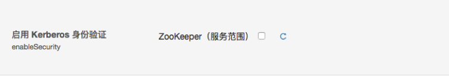
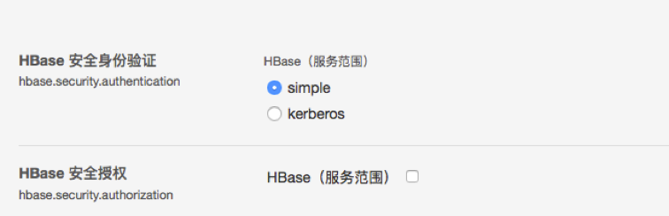
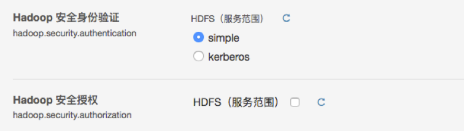
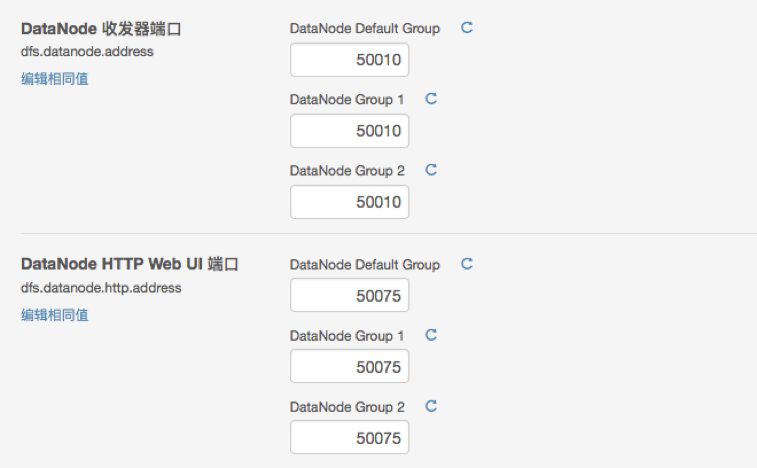
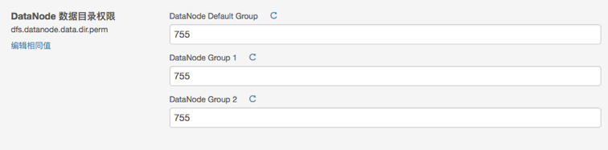

# 如何取消Kerberos


禁用高可用集群的Kerberos
【适用版本5.4、5.5】

注：在一个已经配置好Kerberos的高可用集群中禁用Kerberos，主要关心以下几点：
•	HDFS的故障转移znode的权限更改
•	YARN HA的/yarn-leader-election znode的权限更改
•	Hue ticket-renewer服务的删除

具体操作步骤如下：
1.	停止集群，并停止Cloudera Management Service
2.	启动Zookeeper集群，并在YARN服务停止时，在YARN服务上进行“格式化StateStore”

3.	登录HBase的Kerberos，并删除Zookeeper上的/hbase znode（因为在Secure集群上，Zookeeper的/hbase znode已经加上了ACL，’sasl:hbase:cdrwa’）
```shell
kinit -k -t <hbase.keytab> hbase/<HOST>@ACME.COM
hbase zkcli
rmr /hbase
```
4.	修改zookeeper服务的配置，将security禁用


5.	修改HBase服务的配置，禁用security和授权



6.	修改HDFS服务的配置，禁用security和授权



7.	恢复DataNode的端口地址



8.	恢复DataNode的目录权限



9.	获取Failover Controller的zookeeper 认证秘钥
例如选取一个Kerberos启用时的FailOverController运行时配置文件:
/var/run/cloudera-scm-agent/process/999-hdfs-FAILOVERCONTROLLER/core-site.xml

```xml
<property>
    <name>ha.zookeeper.auth</name>
    <value>digest:hdfs-fcs:fZHCi0r2qufpFV9Z6v4QumH76YnNzV</value>
</property>
```

10.	获取Resource Manager的zookeeper认证秘钥
例如选取一个Kerberos启用时的ResourceManager的运行时配置文件：
/var/run/cloudera-scm-agent/process/1009-yarn-RESOURCEMANAGER/yarn-site.xml

```xml
<property>
    <name>yarn.resourcemanager.zk-auth</name>
    <value>digest:yarn:QTktVapxilNBfkAjCZqkXNWwp5IiVi</value>
</property>
```

11.	登录zookeeper的命令行，删除相关znode的ACL
修改ZKFC故障转移节点的ACL：
$> hbase zkcli
addauth digest hdfs-fcs:fZHCi0r2qufpFV9Z6v4QumH76YnNzV
setAcl /hadoop-ha world:anyone:cdrwa
setAcl /hadoop-ha/nameservice1 world:anyone:cdrwa
setAcl /hadoop-ha/nameservice1/ActiveBreadCrumb world:anyone:cdrwa

【注：除了以上的修改znode的ACL，也可以直接删除/hadoop-ha znode，但在启动HDFS之前必须在FailOverController服务上进行“初始化故障转移znode”的操作】

修改ResourceManager znode的ACL：
$> hbase zkcli
addauth digest yarn:QTktVapxilNBfkAjCZqkXNWwp5IiVi
setAcl /yarn-leader-election world:anyone:cdrwa
setAcl /yarn-leader-election/yarnRM world:anyone:cdrwa
setAcl /yarn-leader-election/yarnRM/ActiveBreadCrumb world:anyone:cdrwa

¬	删除Hue的Kerberos Ticket Renewer服务
¬	部署客户端的配置
¬	重启服务即可
