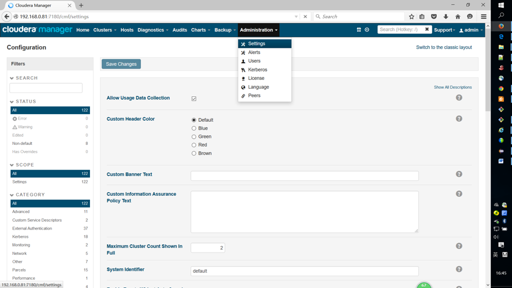
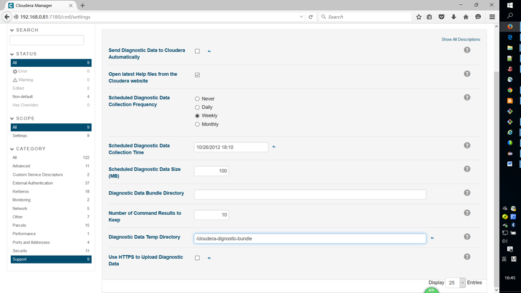
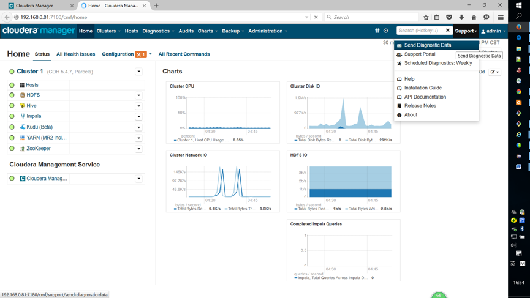
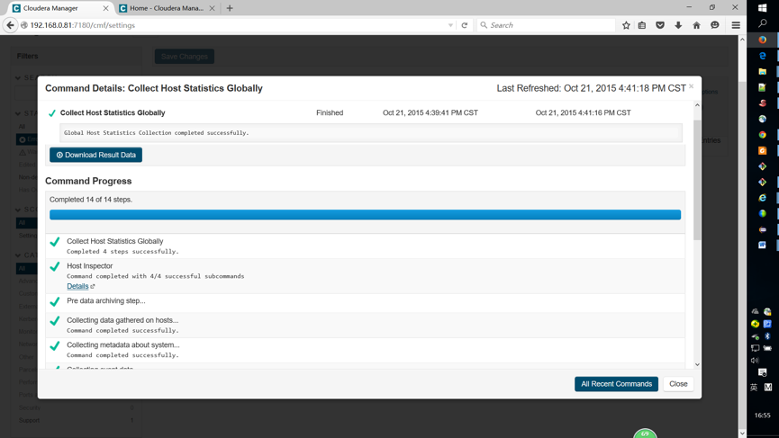
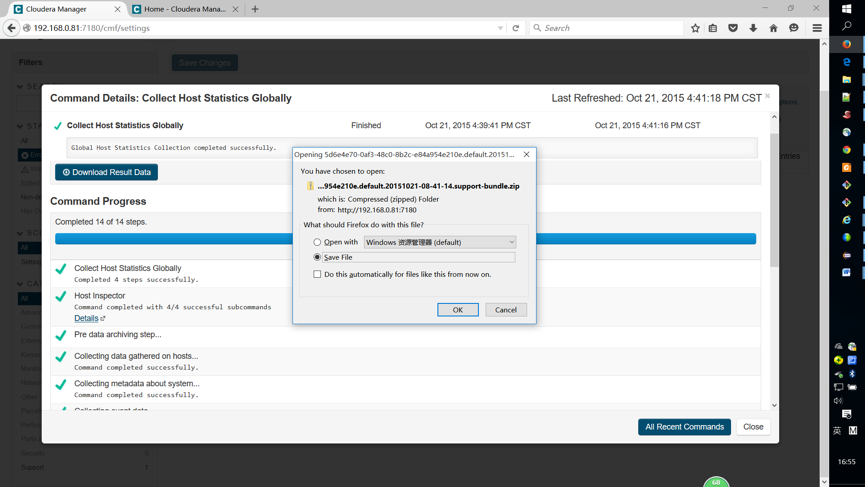

# 如何在线上传诊断包（Diagnositic Bundle）

【第一步】建立cloudera-dignostic-bundle目录
在Cloudera Manager所在服务器上建立一个目录，权限为cloudera-scm用户有写权限

```
mkdir /cloudera-dignostic-bundle
chmod 777 /cloudera-dignostic-bundle
```

【第二步】设置cloudera-dignostic-bundle目录
登陆到Cloudera Manager，进入Administration->Settings，找到Diagnostic Data Temp Directory配置项，并将其值设为上一步中建立的目录地址并保存设置。

注意：如果目前不存在或者权限不正确，保存的时候会出错。




【第三步】生成Diagnostic Bundle，并上传：
点击Support->Send Diagnostic Data



【第四步】点击Download Result Data



